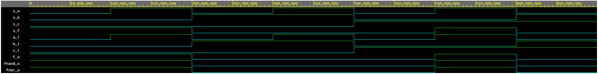
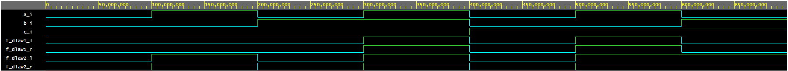

# Digital-electronics-1

## Labs

### 01-gates

#### Demorgan's law
- code listing
 ```vhdl
architecture dataflow of gates is
begin
    f_o     <= ((not b_i) and a_i) or ((not c_i) and (not b_i));
    fnand_o <= not(not((not b_i) and a_i) and not((not c_i) and (not b_i)));
    fnor_o  <= not(b_i or (not a_i)) or not(c_i or b_i);

end architecture dataflow;
```
- simulated waveforms screenshot

[playground link](https://www.edaplayground.com/x/L3Si)

#### Distributive laws
- code listing
 ```vhdl
architecture dataflow of gates is
architecture dataflow of gates is
begin
    f_dlaw1_L <= (a_i and b_i) or (a_i and c_i);
	   f_dlaw1_R <= a_i and (b_i or c_i);
    f_dlaw2_L <= (a_i or b_i) and (a_i or c_i);
    f_dlaw2_R <= a_i or (b_i and c_i);
end architecture dataflow;

```
- simulated waveforms screenshot

[playground link](https://www.edaplayground.com/x/L3Si)


