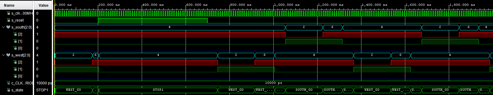
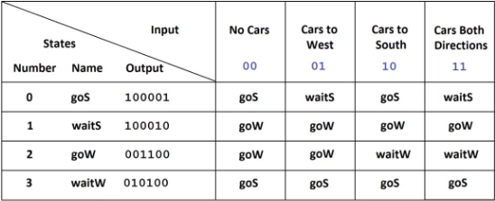

# Digital-electronics-1

## úkol 1: Preparation tasks
### Filled out state table


   | **Input P** | `0` | `0` | `1` | `1` | `0` | `1` | `0` | `1` | `1` | `1` | `1` | `0` | `0` | `1` | `1` | `1` |
| :-- | :-: | :-: | :-: | :-: | :-: | :-: | :-: | :-: | :-: | :-: | :-: | :-: | :-: | :-: | :-: | :-: |
| **Clock** |  |  |  |  |  |  |  |  |  |  |  |  |  |  |  |  |
| **State** | A | A | B | C | C | D | A | B | C | D | B | B | B | C | D | B |
| **Output R** | `0` | `0` | `0` | `0` | `0` | `1` | `0` | `0` | `0` | `1` | `0` | `0` | `0` | `0` | `1` | `0` |


## úkol 2: D latch

### p_d_latch process (`d_latch`)

```vhdl
p_d_latch   : process (d, arst, clk)
    begin
        if  (arst = '1') then
            q       <= '0';
            q_bar   <= '1';
        elsif (clk = '1')then
            q       <=  d;
            q_bar   <=  (not d);
            
        end if;
    end process p_d_latch;
```

### VHDL reset and stimulus processes (`tb_d_latch`)

```vhdl
p_reset_gen : process
    begin
        s_arst <= '0';
        wait for 21 ns;
        
      
        s_arst <= '1';
        wait for 51 ns;
       
        
        s_arst <= '0';
        wait for 41 ns;
        
        
        s_arst <= '1';
        wait for 60 ns;
       
        s_arst <= '0';
        wait;
end process p_reset_gen;

p_stimulus  :   process
    begin


            s_d <= '0';
            s_clk <= '0';
            
            wait for 10ns;
            s_d <= '1';
            wait for 10ns;
            s_d <= '0';
            wait for 10ns;
            s_d <= '1';
            wait for 10ns;
            s_d <= '0';
            
            s_clk <= '1';
          
            wait for 10ns;
            s_d <= '1';
            wait for 10ns;
            s_d <= '0';
            wait for 10ns;
            s_d <= '1';
            wait for 10ns;
            s_d <= '0'; 
            
            s_d <= '1';
            s_clk <= '0';
            
            wait for 10ns;
            s_d <= '1';
            wait for 10ns;
            s_d <= '0';
            wait for 10ns;
            s_d <= '1';
            wait for 10ns;
            s_d <= '0';
            
            s_clk <= '1';
          
            wait for 10ns;
            s_d <= '1';
            wait for 10ns;
            s_d <= '0';
            wait for 10ns;
            s_d <= '1';
            wait for 10ns;
            s_d <= '0';       
            report "Stimulus process finished" severity note;
            wait;    
end process p_stimulus;

```

### Screenshot with waveforms




## úkol 3: Flip-flops

## d_ff_arst

### p_d_ff_arst process (`d_ff_arst`)

```vhdl
    p_d_ff_arst : process (arst, clk)
    begin
        if  (arst = '1') then
            q       <= '0';
            q_bar   <= '1';
        elsif (rising_edge(clk))then
            q       <=  d;
            q_bar   <=  (not d);
            
        end if;
    end process p_d_latch;
```

### VHDL clock, reset and stimulus processes (`tb_d_ff_arst`)

```vhdl
p_clk_gen : process
    begin
        while now < 750 ns loop         -- 75 periods of 100MHz clock
            s_clk_100MHz <= '0';
            wait for c_CLK_100MHZ_PERIOD / 2;
            s_clk_100MHz <= '1';
            wait for c_CLK_100MHZ_PERIOD / 2;
        end loop;
        wait;
end process p_clk_gen;

p_reset_gen : process
    begin
        s_arst <= '0';
        wait for 21 ns;
        
      
        s_arst <= '1';
        wait for 51 ns;
       
        
        s_arst <= '0';
        wait for 41 ns;
        
        
        s_arst <= '1';
        wait for 60 ns;
       
        s_arst <= '0';
        wait;
end process p_reset_gen;
 p_stimulus : process
    begin
        report "Stimulus process started" severity note;
            s_d <= '0';
                      
            wait for 20ns;
            s_d <= '1';
            wait for 10ns;
            s_d <= '0';            
            wait for 10ns;
            s_d <= '0';                      
            wait for 10ns;
            s_d <= '1';
            wait for 10ns;
            s_d <= '0';
            wait for 10ns;
            s_d <= '1';
            wait for 10ns;
            s_d <= '0'; 
            wait for 10ns;
            s_d <= '1';
            wait for 10ns;
            s_d <= '0';
            wait for 10ns;
            s_d <= '1';
            wait for 10ns;
            s_d <= '0';
            wait for 10ns;
            s_d <= '1';
            wait for 10ns;
            s_d <= '0'; 
            wait for 10ns;
            s_d <= '1';
            wait for 10ns;
            s_d <= '0';
            wait for 10ns;
            s_d <= '1';
            wait for 10ns;
            s_d <= '0';
            wait for 10ns;
            s_d <= '1';
            wait for 10ns;
            s_d <= '0'; 
            wait for 10ns;
            s_d <= '1';
            wait for 10ns;
            s_d <= '0';
            wait for 10ns;
            s_d <= '1';
            wait for 10ns;
            s_d <= '0';
            wait for 10ns;
            s_d <= '1';
            wait for 10ns;
            s_d <= '0'; 
            wait for 10ns;
            s_d <= '1';
            wait for 10ns;
            s_d <= '0'; 
            wait for 10ns;
            s_d <= '1';
            wait for 10ns;
            s_d <= '0';
            wait for 10ns;
            s_d <= '1';
            wait for 10ns;
            s_d <= '0';
            wait for 10ns;
            s_d <= '1';
            wait for 10ns;
            s_d <= '0'; 
    
    report "Stimulus process finished" severity note;
        wait;
    end process p_stimulus;

```

### Screenshot with waveforms


## d_ff_rst

### p_d_ff_rst process (`d_ff_rst`)

```vhdl
p_d_ff_rst   : process (d, rst, clk)
    begin
        if rising_edge(clk) then
            if  (rst = '1') then
                q       <= '0';
                q_bar   <= '1';
            else
                q       <=  d;
                q_bar   <=  (not d);
            end if;
        end if;
end process p_d_ff_rst;
```

### VHDL clock, reset and stimulus processes (`tb_d_ff_rst`)

```vhdl
p_clk_gen : process
    begin
        while now < 750 ns loop         -- 75 periods of 100MHz clock
            s_clk_100MHz <= '0';
            wait for c_CLK_100MHZ_PERIOD / 2;
            s_clk_100MHz <= '1';
            wait for c_CLK_100MHZ_PERIOD / 2;
        end loop;
        wait;
 end process p_clk_gen;

p_reset_gen : process
    begin
        s_arst <= '0';
        wait for 21 ns;
        
      
        s_arst <= '1';
        wait for 51 ns;
       
        
        s_arst <= '0';
        wait for 41 ns;
        
        
        s_arst <= '1';
        wait for 60 ns;
       
        s_arst <= '0';
        wait;
end process p_reset_gen;
 p_stimulus : process
    begin
        report "Stimulus process started" severity note;
            s_d <= '0';
                      
            wait for 20ns;
            s_d <= '1';
            wait for 10ns;
            s_d <= '0';            
            wait for 10ns;
            s_d <= '0';                      
            wait for 10ns;
            s_d <= '1';
            wait for 10ns;
            s_d <= '0';
            wait for 10ns;
            s_d <= '1';
            wait for 10ns;
            s_d <= '0'; 
            wait for 10ns;
            s_d <= '1';
            wait for 10ns;
            s_d <= '0';
            wait for 10ns;
            s_d <= '1';
            wait for 10ns;
            s_d <= '0';
            wait for 10ns;
            s_d <= '1';
            wait for 10ns;
            s_d <= '0'; 
            wait for 10ns;
            s_d <= '1';
            wait for 10ns;
            s_d <= '0';
            wait for 10ns;
            s_d <= '1';
            wait for 10ns;
            s_d <= '0';
            wait for 10ns;
            s_d <= '1';
            wait for 10ns;
            s_d <= '0'; 
            wait for 10ns;
            s_d <= '1';
            wait for 10ns;
            s_d <= '0';
            wait for 10ns;
            s_d <= '1';
            wait for 10ns;
            s_d <= '0';
            wait for 10ns;
            s_d <= '1';
            wait for 10ns;
            s_d <= '0'; 
            wait for 10ns;
            s_d <= '1';
            wait for 10ns;
            s_d <= '0'; 
            wait for 10ns;
            s_d <= '1';
            wait for 10ns;
            s_d <= '0';
            wait for 10ns;
            s_d <= '1';
            wait for 10ns;
            s_d <= '0';
            wait for 10ns;
            s_d <= '1';
            wait for 10ns;
            s_d <= '0'; 
    
    report "Stimulus process finished" severity note;
        wait;
    end process p_stimulus;
```

### Screenshot with waveforms


## jk_ff_rst

### p_jk_ff_rst process (`jk_ff_rst`)

```vhdl
p_jk_ff_rst   : process (clk)
    begin
        if rising_edge(clk) then
            if  (rst = '1') then
                s_q     <= '0';
                
            else
                if    (j = '0' and k = '0')then
                    s_q <=  s_q;
                    
                elsif (j = '0' and k = '1')then
                    s_q <=  '0';
                    
                elsif (j = '1' and k = '0')then
                    s_q <=  '1';
                
                elsif (j = '1' and k = '1')then
                    s_q <=  (not s_q);
                    
                end if;
            end if;
        end if;
end process p_jk_ff_rst;
```

### VHDL clock, reset and stimulus processes (`tb_jk_ff_rst`)

```vhdl
p_clk_gen : process
    begin
        while now < 750 ns loop         -- 75 periods of 100MHz clock
            s_clk_100MHz <= '0';
            wait for c_CLK_100MHZ_PERIOD / 2;
            s_clk_100MHz <= '1';
            wait for c_CLK_100MHZ_PERIOD / 2;
        end loop;
        wait;
    end process p_clk_gen;

p_reset_gen : process
    begin
        s_rst <= '0';
        wait for 20 ns;
        
      
        s_rst <= '1';
        wait for 12 ns;
       
        
        s_rst <= '0';
        wait for 30 ns;
        
        
        s_rst <= '1';
        wait for 12 ns;
       
        s_rst <= '0';
        wait;
end process p_reset_gen;
 p_stimulus : process
    begin
        report "Stimulus process started" severity note;
            s_j <= '0';
            s_k <= '0';           
            wait for 20ns;
            
            s_j <= '0';
            s_k <= '1';           
            wait for 20ns;
            
            s_j <= '1';
            s_k <= '0';           
            wait for 20ns;
            
            s_j <= '1';
            s_k <= '1';           
            wait for 20ns;
            
            
            s_j <= '0';
            s_k <= '0';           
            wait for 20ns;
            
            s_j <= '0';
            s_k <= '1';           
            wait for 20ns;
            
            s_j <= '1';
            s_k <= '0';           
            wait for 20ns;
            
            s_j <= '1';
            s_k <= '1';           
            wait for 20ns;
            
            s_j <= '0';
            s_k <= '0';           
            wait for 20ns;
            
            s_j <= '0';
            s_k <= '1';           
            wait for 20ns;
            
            s_j <= '1';
            s_k <= '0';           
            wait for 20ns;
            
            s_j <= '1';
            s_k <= '1';           
            wait for 20ns;
            
            s_j <= '0';
            s_k <= '0';           
            wait for 20ns;
            
            s_j <= '0';
            s_k <= '1';           
            wait for 20ns;
            
            s_j <= '1';
            s_k <= '0';           
            wait for 20ns;
            
            s_j <= '1';
            s_k <= '1';           
            wait for 20ns;
            
            s_j <= '0';
            s_k <= '0';           
            wait for 20ns;
            
            s_j <= '0';
            s_k <= '1';           
            wait for 20ns;
            
            s_j <= '1';
            s_k <= '0';           
            wait for 20ns;
            
            s_j <= '1';
            s_k <= '1';           
            wait for 20ns;
            
            
    
    report "Stimulus process finished" severity note;
        wait;
    end process p_stimulus;
```

### Screenshot with waveforms


## t_ff_rst

### p_t_ff_rst process (`t_ff_rst`)

```vhdl
p_t_ff_rst   : process (clk)
    begin
        if rising_edge(clk) then
            if  (rst = '1') then
                s_q     <= '0';
                
            else
                if    (t = '0')then
                    s_q <=  s_q;
                
                elsif (t = '1') then
                    s_q <=  (not s_q);                                  
                    
                end if;
            end if;
        end if;
end process p_t_ff_rst;
```

### VHDL clock, reset and stimulus processes (`tb_t_ff_rst`)

```vhdl
p_clk_gen : process
    begin
        while now < 750 ns loop         -- 75 periods of 100MHz clock
            s_clk_100MHz <= '0';
            wait for c_CLK_100MHZ_PERIOD / 2;
            s_clk_100MHz <= '1';
            wait for c_CLK_100MHZ_PERIOD / 2;
        end loop;
        wait;
    end process p_clk_gen;

p_reset_gen : process
    begin
        s_rst <= '0';
        wait for 20 ns;
        
      
        s_rst <= '1';
        wait for 12 ns;
       
        
        s_rst <= '0';
        wait for 30 ns;
        
        
        s_rst <= '1';
        wait for 12 ns;
       
        s_rst <= '0';
        wait;
end process p_reset_gen;
 p_stimulus : process
    begin
        report "Stimulus process started" severity note;
            
            s_t <= '0';           
            wait for 51ns;
            s_t <= '1';
            wait for 49ns;
            
            s_t <= '0';           
            wait for 51ns;
            s_t <= '1';
            wait for 49ns;
            
            s_t <= '0';           
            wait for 51ns;
            s_t <= '1';
            wait for 49ns;
            
            s_t <= '0';           
            wait for 51ns;
            s_t <= '1';
            wait for 49ns;
            
            s_t <= '0';           
            wait for 99ns;
            s_t <= '1';
            wait for 101ns;

    report "Stimulus process finished" severity note;
        wait;
    end process p_stimulus;

```

### Screenshot with waveforms


## Úkol 4: Shift register




